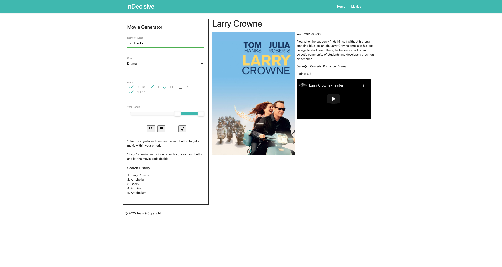

# Indecisive

Project Description:

Are you feeling indecisive about what movie to watch? Perhaps you're in the mood for a specific genre like comedy or want to enjoy a film starring Brad Pitt, but you're not sure which one to pick. Enter nDecisive, your ultimate movie decision-making companion.

How It Works:

nDecisive simplifies the movie selection process. You have the flexibility to set as many or as few criteria as you'd like, and we'll provide you with a tailored movie recommendation. Here's how it works:

Custom Criteria: You can specify your preferences by entering details such as the actor's name, preferred genre, and desired movie rating.

Random Choice: If you're feeling adventurous or prefer to leave it to chance, you can choose to receive a completely random movie suggestion with no specific criteria.

Discover and Enjoy: Once you've made your selection, we'll present you with the chosen movie's rating and even provide a trailer link so you can get a sneak peek.

With nDecisive, movie night just got a whole lot easier and more enjoyable. Say goodbye to decision fatigue and hello to cinematic bliss.

Ready to embark on your movie adventure? Try nDecisive today and let the movie magic begin!

# Links

* [Website](https://maxhanson07.github.io/Indecisive/)
* [Github Repo](https://github.com/MaxHanson07/Indecisive)

# Languages Used

Languages used: [HTML, CSS, JavaScript, jQuery, Materialize]
API's used: [api.themoviedb.org/3/discover, api.tmdb.org/3/search/person, api.themoviedb.org/3/movie/, api.tmdb.org/3/search/person]

# Screenshot

